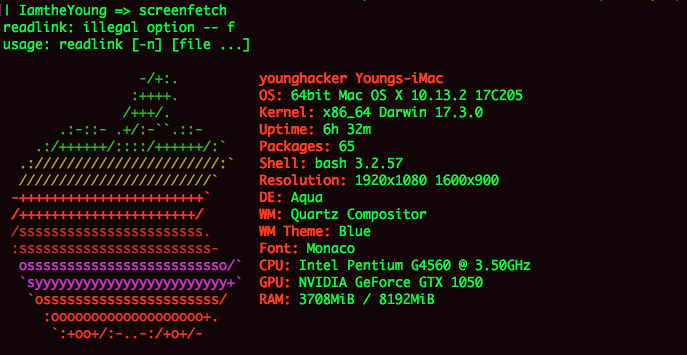
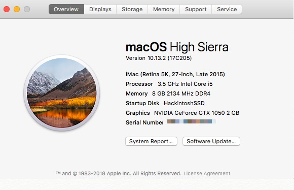

# Hackintosh-EFI
Intel G4560 Hackintosh in Early 2018.

&nbsp;&nbsp;&nbsp;&nbsp;I built my first Hackintosh yesterday (Mar. 13th 2018) and I thought it was more easier than I used to trying when I was at my college years before. It is running stably and working much more fast than my Macbook Air Mid 2015 8G(CTO). And now I'm using my hackintosh to write the new ropo. It's quite simple and you can have a try if you want.

    * CPU                              Intel Pentium G4560 (2C4T, 3Mb Cache, 3.5GHz with Hyper-Thread Tech) 
    * Motherboard                      Gigabytes GA-B250M-D3H 
    * Graphic                          Gigabytes Nvidia-GTX-1050 OC (2G)
    * RAM                              Crucial 8G (1*8G DDR4-2133)
    * Storage                          WestDigital 1T (HDD NTFS) + Netac 128G(HackintoshSSD) + 30G(SSD APFS) + 500G(HDD APFS) + 250G(HDD TimeMachine)
    * Power                            EVGA 450W (PS: I prefer Deleta NX350 more)
    * Case                             CoolerMaster U2-Box
    * Monitor                          Dell 21.5’+19.5'
    * OS                               Windows 10 Pro + macOS High Sierra

  
 

  
 

